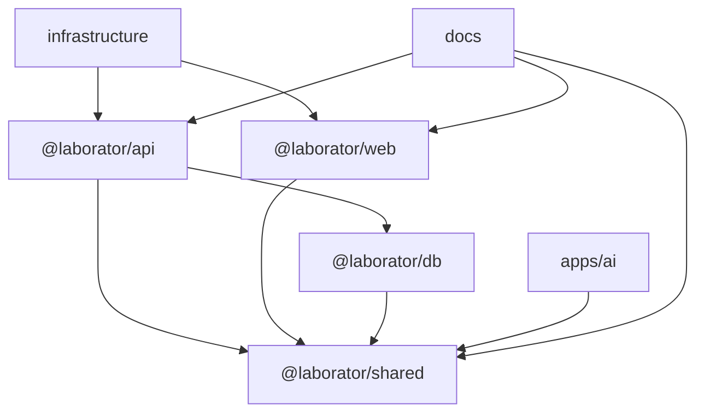

# Dependency Graph Baseline

Status: Batch 01 baseline

## Workspace Dependency Summary

## Runtime Boundaries

- Frontend code must use API contracts and must not access the database directly.
- Backend modules must access persistence through repositories.
- Shared utilities must not depend on API or Web applications.
- Infrastructure scripts must validate deployments without changing product behavior.

## Batch 01 Dependency Impact

- New shared utilities remain dependency-leaf safe: they import no API, Web, or DB code.
- API health checks may import shared product constants only.
- CI invokes existing package scripts and infrastructure validation commands.

